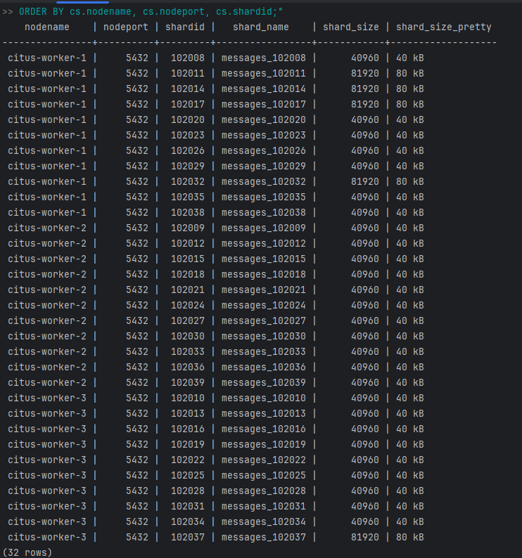

# 1. Запуск 
docker-compose up -d

# 2. Проверка подключения к БД
Инициализируем Citus ./scripts/init.sh

# 3. Генерация тестовых данных
Необходимо взять id пользователей из БД первого микросервиса

docker exec -it pgmaster psql -U postgres -d social_network -c "SELECT id FROM users LIMIT 10;"

Например:
377e0671-4beb-4ae0-a0f1-da445f5d41ce
a98766e4-8801-4ad2-8154-1bea061ad90a
139b68c0-177d-480c-b403-84b5ab01706c
a33eb4ab-21a5-4c23-a2cb-dcac4787db24
5d393a6d-c413-40f0-b736-74d0e7a86de8

Генерируем сообщения:

./scripts/generate-messages.sh

# 4. Проверка распределения данных
docker exec -it citus-coordinator psql -U postgres -d dialog -c "SELECT
cs.nodename,
cs.nodeport,
cs.shardid,
cs.shard_name,
cs.shard_size,
pg_size_pretty(cs.shard_size) as shard_size_pretty
FROM citus_shards cs
JOIN pg_class pc ON pc.oid = cs.table_name::oid
WHERE pc.relname = 'messages'
ORDER BY cs.nodename, cs.nodeport, cs.shardid;"

**Результат:** 

# 5. Отправка сообщения
curl -X POST http://localhost:8081/dialog/5d393a6d-c413-40f0-b736-74d0e7a86de8 \
-H "Content-Type: application/json" \
-d '{"text": "Hello World!"}'

# 6. Получение диалога
curl -X GET http://localhost:8080/dialog/5d393a6d-c413-40f0-b736-74d0e7a86de8

-- Проверка распределения
SELECT
shardid,
nodename,
nodeport,
COUNT(*) as message_count
FROM citus_shards
JOIN messages ON shard_name = 'messages_' || shardid::text
WHERE table_name = 'messages'
GROUP BY shardid, nodename, nodeport
ORDER BY shardid;